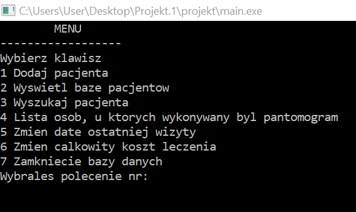
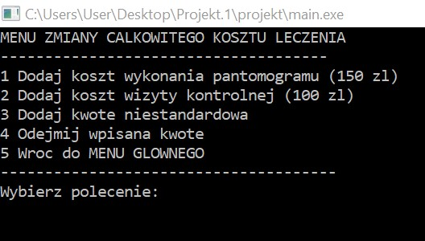
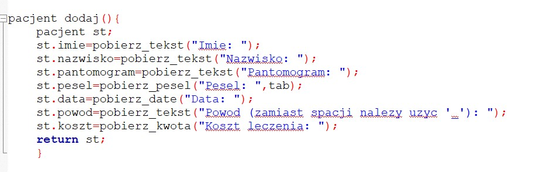
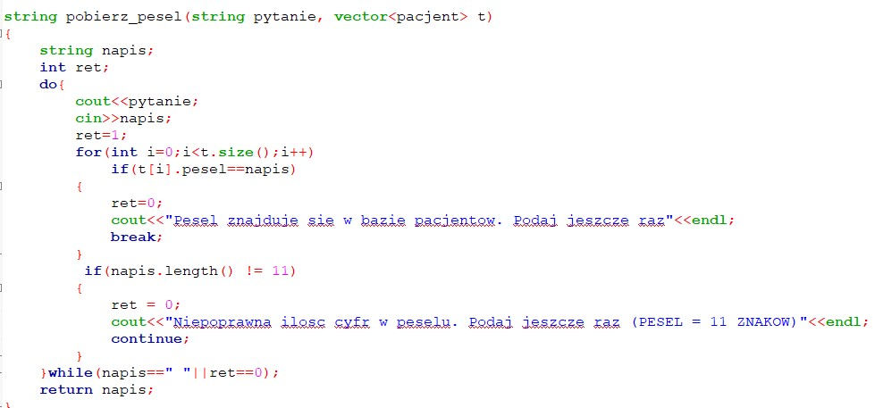
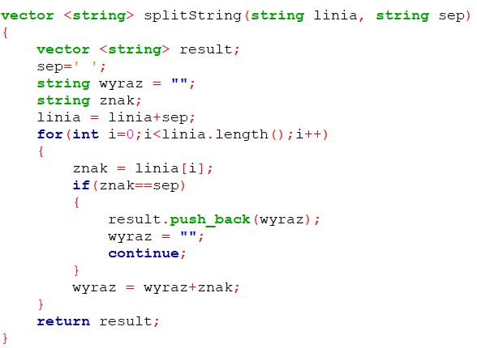
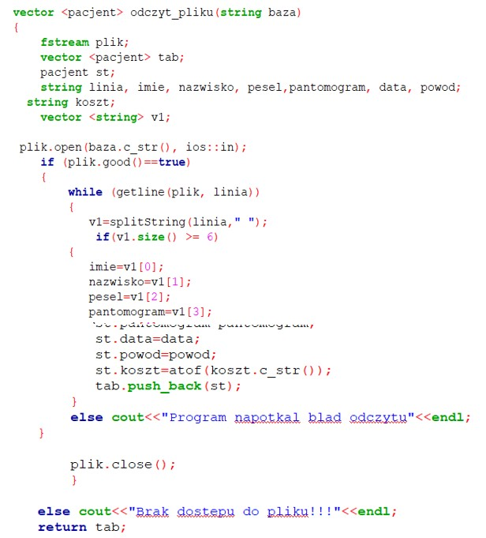

# Patient_database
# General info
The above program presents a simple patient database of a dental office made as part of a student project.

Application created with CodeBlocks.

The dental practice patient database consists of a main menum(Menu główne) and a menu for changing the total cost of treatment(Menu zmiany całkowitego kosztu leczenia). The main menu consists of the following options: "Add patient"( Dodaj pacjenta) , "View patient database"(Wyświetl bazę pacjentów), "Search for a patient"(Wyszukaj pacjenta), "List of people who underwent a panoramic radiograph" (Lista osób, u których wykonywany był pantomogram), "Update the date of the last visit"(Zmień datę ostatniej wizyty), "Change the total cost of treatment" (Zmień całkowity koszt leczenia) and " Close database ” (zamknięcie bazy danych).

After selecting the option "Change the total cost of treatment" from the main menu, the menu for changing the total cost of treatment is displayed, which consists of the following options: "Add cost of a panoramic radiograph (PLN 150)" (Dodaj koszt wykonania pantomogramu (150 zł), "Add cost of a follow-up visit (PLN 100)" (Dodaj koszt wizyty kontrolnej (100 zł), " Add a non-standard amount" (Dodaj kwotę niestandardową)," Subtract the entered amount" (Odejmij wpisaną kwotę)," back to the MAIN MENU"( wróć do menu głownego).

The following function allows you to add patient data to the database. The get_text () function allows you to get the text entered and assign it to a given variable on the stack as a string variable. In other cases, safeguards were applied, including the fact that it was not possible to enter a personal identification number with a number of digits other than 11.

--
The following functions enable the opening of the text file baza.txt:
The splitString function returns words separated by a space, it allows read a text file. The push_back () method adds the character specified as the argument to the end of the string: 

